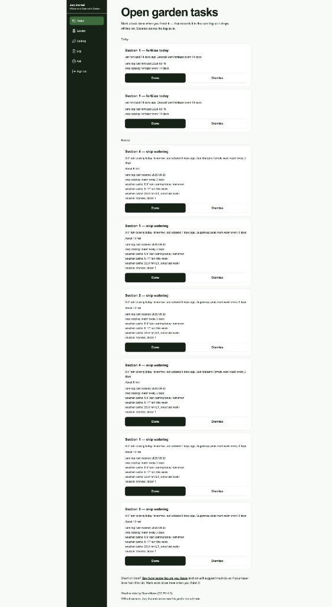
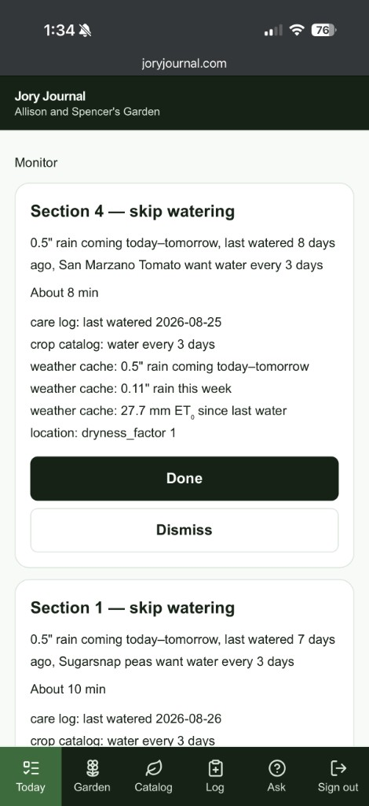
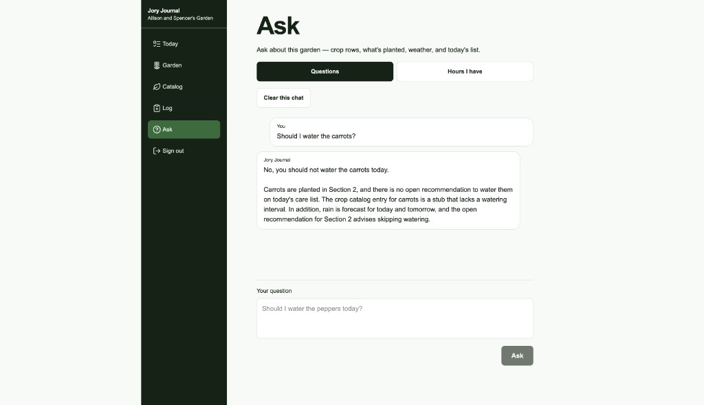
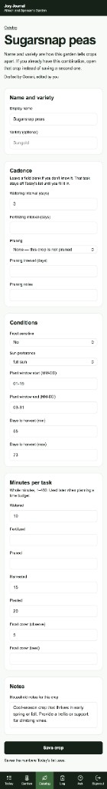

# Jory Journal

I built this because my husband and I were struggling with garden management. We are aspirational about what our garden will produce and look like, but every year we seem to mismanage a crop or underwater a flower, or just get overwhelmed by the to-do list and give up in August.

We wanted to still be in the garden in August — and confident we were using our time well.

**Jory Journal** is the app for that household: one raised bed and a handful of pots, two people, the same garden. It remembers what is planted where. Each morning it builds a **Today** list from stored crop-care numbers, weather, and the care log. When time is tight, **Ask** helps cut that list to the hours we have.

Live: [https://www.joryjournal.com](https://www.joryjournal.com)

This GitHub repo is still named GreenThumb. The product is Jory Journal.

## How it looks

The default screen is the list, not a chat. Done writes the care log so the task drops off. Dismiss does not.



On a phone in the yard, the same list shows its work: catalog cadence, last care date, forecast rain, ET₀. That is matching, not a model guessing that tomatoes “look thirsty.”



**Ask** is optional. It answers from this garden — crop rows, plantings, weather, and the list already on Today — including a time-budget mode when we say how many hours we have.



A crop row is the system of record for watering intervals, minutes per task, and the rest. The model may draft it once; we edit it.



## Why the AI is shaped this way

I refused to let a model write the daily watering list. That would have been over-use of AI. A more deterministic approach was good enough for the outcome we wanted, so I wanted to save the token usage for elsewhere.

**Ask / time-budget** and a **first-draft crop row** are the places we use AI. Watering tasks matter, but once we have rainfall and a crop-care row, the AI isn’t necessary.

Today is computed: stored crop needs × rain and ET₀ × the care log, with templated copy you can check. The morning job does not call a model. Ask is a tool-using conversation over that same state; it does not invent watering tasks. The crop-row draft is one structured call when a crop first appears. If the draft is wrong, we edit the row — we do not hope tomorrow’s prompt is better.

Five destinations (plus sign out): **Today**, **Garden**, **Catalog**, **Log**, **Ask**. Sign-in is two allowlisted magic-link accounts. There is no multi-household product. Without sensors, the app cannot see this yard’s microclimate; that is an honest limit, not a roadmap tease on the home screen.

## Stack

Next.js App Router, TypeScript, Tailwind, shadcn/ui, Drizzle, Supabase Postgres, Vercel. Weather from Open-Meteo. LLM behind a provider seam (Gemini in development, Anthropic available) for Ask and crop drafts only.

Product truth: `docs/project-brief.md`. Architecture: `docs/architecture.md`.

## Run it locally

You need Node.js 22+, npm, and a Supabase project. Details for keys and auth live in `.env.example` and `docs/architecture.md`.

```sh
npm install
cp .env.example .env.local
# Set DATABASE_URL (Supabase session pooler), Supabase keys, SITE_URL, ALLOWED_EMAILS, and an LLM key.
npm run db:migrate
npm run dev
```

Open [http://localhost:3000](http://localhost:3000). Health (no sign-in): [http://localhost:3000/health](http://localhost:3000/health).

```sh
npm run lint
npm run typecheck
npm test
npm run build
```
