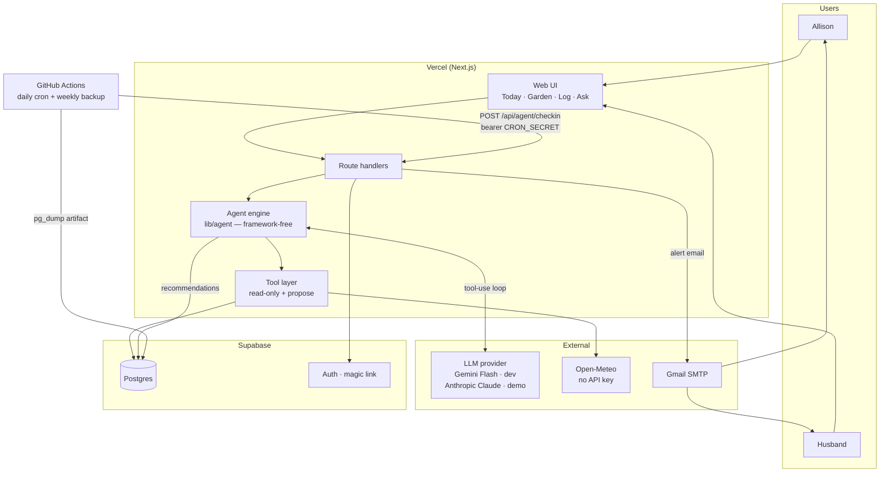

# Architecture

## Overview

GreenThumb is a web app that holds persistent state for a single household garden — one 50′ × 3′ raised bed divided into seasonal sections, plus 8 permanent pots — and uses an LLM agent to turn that state plus live weather into specific care recommendations. It serves exactly two users (Allison and her husband) managing exactly one garden.

The system replaces memory. Its value comes entirely from retaining garden context that a general-purpose chatbot cannot: what is planted where, how much sun each spot gets, what care was done when, and what the weather has done and is about to do.

Design horizon is deliberately short: a one-month build to a working demo around **September 3, 2026**, on free or near-free infrastructure, for 2 users and ~14 growing locations. Nothing here is built for scale that does not exist.

## Stack

| Layer | Choice | Why |
| --- | --- | --- |
| Framework | Next.js (App Router) + TypeScript | One repo for UI and server, streaming responses, zero-config deploys. Boring and fast. |
| Hosting | Vercel Hobby | Free, push-to-deploy. Functions allow up to 300s, which comfortably fits an agent loop. |
| Database | Supabase Postgres (free) | Relational fits the location/planting/action model. 500 MB is ~1000× what this needs. |
| Auth | Supabase Auth, email magic link | No passwords to store or handle. Two real accounts, so the action log can attribute who did what. |
| ORM / migrations | Drizzle | Typed schema, plain SQL migrations, light in serverless. |
| UI | Tailwind + shadcn/ui | Mobile-first component set without design work. |
| LLM | Gemini Flash free tier for development; Anthropic Claude (Sonnet for the daily run, Haiku for Q&A) for the demo path | Split by workload, not by preference — see below. Both sit behind one provider seam. |
| Weather | Open-Meteo | Free, **no API key**, 16-day forecast plus `past_days` history, and reference evapotranspiration (ET₀) — a direct measure of how fast soil is drying. |
| Email | Nodemailer over Gmail SMTP (app password) | Free, reaches both users with no domain or DNS setup. |
| Scheduler | GitHub Actions cron | Free, flexible cadence, timezone-controllable, and every run leaves a log. Vercel Hobby cron is once-per-day, UTC-only, and fires anywhere within the scheduled hour. |

Two notes on the stack that matter more than they look:

**The LLM sits behind a provider seam, and both sides of it are used.** All model calls go through one module (`lib/llm/`) exposing a single `runToolLoop()` interface, with an Anthropic implementation and a Gemini implementation. Provider is selected by environment variable, defaulting to Gemini locally and Anthropic in production.

The split follows the workloads, which pull in opposite directions:

- **Development is high-volume and low-stakes.** Tuning an agent loop means running it dozens to low-hundreds of times a day. Gemini's free Flash tier allows ~1,500 requests/day at 10–15 requests/minute with no credit card; at ~8 model calls per agent run that is roughly **185 full runs per day, free** — comfortably more than iteration needs.
- **Production is low-volume and high-stakes.** One scheduled run per day, plus light Q&A, against a graded demo. Here the cost is trivial and multi-step tool-use reliability is worth paying for, since a model that drops or malforms a tool call mid-loop fails the exact property this project is assessed on.

Running free during development is not only about money. Metered iteration quietly discourages iteration, and the thing you would iterate less on is the agentic core — the one graded deliverable.

Treating Gemini as a mere emergency fallback was rejected: an escape hatch that is never exercised is not an escape hatch. Because dev traffic runs on it continuously, the fallback is known-working *and* a real quality comparison exists by the end of Phase 3, when the final demo-path provider is chosen from evidence rather than assumption.

Two operational details. The Gemini key must live in a **separate Google Cloud project with billing disabled** — enabling billing on a project permanently removes its free tier. And Google may use free-tier prompts for training, which is an accepted trade here given that the data is one household's vegetable garden.

**Open-Meteo requires attribution** under its CC BY 4.0 data licence. A footer credit satisfies this. Non-commercial use is free up to 10,000 calls/day; this app will make roughly 1–2.

## System diagram



The important structural property: **the agent engine is a plain TypeScript module with no framework dependency.** It is called from a Next route handler (for Q&A) and from a Node script (for the scheduled run). That keeps the scheduled job free of serverless timeout risk if it ever outgrows 300s, and it means the agent can be exercised from a test script without booting a web server.

## Folder structure

```
app/
  (auth)/                 magic-link sign-in
  today/                  open recommendations — the primary screen
  garden/                 locations, sun zones, seasons, plantings
  log/                    action log entry + history
  ask/                    Q&A chat (streamed)
  api/
    agent/checkin/        scheduled run entrypoint (secret-gated)
    agent/ask/            streaming Q&A
    recommendations/      done / dismiss
    log/                  create action log entries
lib/
  agent/                  the engine: loop, prompts, run recording
    tools/                one file per tool, each a plain async function
  llm/                    provider seam (anthropic.ts, gemini.ts)
  weather/                Open-Meteo client + cache + normalization
  notify/                 email composition and send with dedupe
  db/                     Drizzle schema, migrations, queries
  garden/                 sun-exposure derivation, day-boundary helpers
scripts/
  checkin.ts              scheduled run, invoked by GitHub Actions
  seed.ts                 seeds the real garden: bed, sun zones, 8 pots
.github/workflows/
  checkin.yml             daily cron
  backup.yml              weekly pg_dump
```

## Data model

### The central modeling decision: position owns sun exposure

The brief raised this as an open question, and it is the one modeling call that shapes everything else. The bed never moves, but sun exposure varies along its 50 feet, and the section boundaries are re-cut every season.

**Resolution: sun exposure is a property of *position along the bed*, entered once and permanent. Sections are seasonal intervals over that fixed strip, and their exposure is derived from the positions they cover.**

```
Bed, 0 ft ─────────────────────────────────────────────── 50 ft
sun_zone:  [0–18 full_sun] [18–34 part_sun] [34–50 part_shade]   ← permanent, entered once
                                                                    
2026 sections: [Sec 1: 0–10][Sec 2: 10–22][Sec 3: 22–34][Sec 4: 34–50]
                  full_sun    mixed¹        part_sun       part_shade
2027 sections: [A: 0–16][B: 16–30][C: 30–40][D: 40–50]           ← re-cut, exposure re-derived
                full_sun   mixed²    part_shade  part_shade         with zero re-entry

¹ 8 ft full_sun + 4 ft part_sun → surfaced as "mostly full sun"
² 14 ft part_sun + ... etc.
```

The alternative — asking the user to re-enter sun exposure per section each season — was rejected. It re-collects a fact that has not changed, and it invites drift where two sections covering the same ground disagree. Deriving it also means that when reality *does* change (a tree comes down, a fence goes up), you edit one sun zone and every section's exposure updates.

Derived exposure is **cached on the section row with an `override` escape hatch**, so the agent and UI read one column, and the user can correct the derivation without fighting it.

### Entities

**Permanent layer** — physical facts, entered once at setup:

- `garden` — singleton. Coordinates, timezone, hardiness zone, optional frost dates.
- `bed` — dimensions (50 × 3), soil type.
- `sun_zone` — `(bed_id, start_ft, end_ft, sun_exposure)`. Non-overlapping, covering 0→50. **The durable source of truth for sun.**
- `pot` fields live on `location` (below) — pots are permanent *and* are directly plantable, so they need no seasonal wrapper.

**Seasonal layer** — what changes:

- `season` — name, date range, `is_current`.
- `location` — the unit of planting and care, with a `kind` discriminator:
  - `kind = 'bed_section'`: `bed_id`, `start_ft`, `end_ft`, `season_id`. Exposure and soil **derived** from the bed and its sun zones.
  - `kind = 'pot'`: `season_id IS NULL` (permanent). Own `sun_exposure`, `volume_gal`, `material`, `soil_type`.
  - Shared: `name`, `sun_exposure` (cached), `sun_exposure_source` (`derived` | `override`), `dryness_factor`, `notes`, `retired_at`.

A single `location` table with kind-dependent `CHECK` constraints was chosen over separate `pot` and `bed_section` tables. At ~14 rows the cost is a few nullable columns; the benefit is that `planting`, `action_log`, and `recommendation` all get one real foreign key instead of a polymorphic reference, and the agent's tools return one uniform list. A `current_location` view unions permanent pots with the current season's sections.

`dryness_factor` is where "pots dry out faster than the bed" lives as data rather than as a hardcoded rule — pot material and volume feed it, and the agent receives it as an input.

**Activity layer:**

- `planting` — `location_id`, crop name + variety, method (seed/transplant), `planted_on`, `removed_on`, status, plus LLM-derived `harvest_window_start/end`, `harvest_confidence`, and `harvest_rationale` with the estimating model recorded.
- `action_log` — `location_id?`, `planting_id?`, `user_id`, `action_type` (watered / fertilized / pruned / harvested / planted / observed / treated), `occurred_at`, free-text detail. Append-only in spirit. **This is the memory replacement and the system's ground truth.**
- `garden_note` — free-text user observations and corrections, injected into agent context. The cheap way to correct the model without a dataset: "the far end floods", "our tomatoes always ripen late". See *Handling an unverifiable knowledge source*.

**Weather layer:**

- `weather_day` — normalized, one row per `(garden_id, date, kind)` where kind is `observed` or `forecast`: precipitation, min/max temp, ET₀, wind. Upserted.
- `weather_fetch` — audit: request URL, timestamp, raw JSON, success/error.

Weather is cached rather than fetched per request, for three reasons: repeat agent runs stay cheap and consistent, the app works if Open-Meteo is briefly down, and — most usefully — the exact forecast behind any past recommendation stays inspectable, which is what makes "it skipped watering because rain was coming" demonstrable after the fact rather than merely claimed.

**Agent layer:**

- `agent_run` — kind, trigger, status, timings, **provider** and model, token counts, estimated cost, the full `tool_calls` trace, linked `weather_fetch_id`, and `simulated_weather` when in demo mode. Recording the provider alongside the tool trace is what turns the Phase 3 provider decision into a data question — malformed or skipped tool calls are visible per provider rather than recalled anecdotally. This is the observability backbone; Supabase's free tier retains platform logs for only **1 day**, so run history must live in our own table.
- `recommendation` — first-class persisted record: `location_id`, `action_type`, `urgency` (now / today / this_week / monitor), `headline`, `rationale`, `confidence`, `evidence` (facts vs. inferences, separated), `status` (open / done / dismissed / superseded / expired), and `resolved_action_log_id` closing the loop when the user marks it done.
- `conversation` / `message` — Q&A history, each assistant message linked to its `agent_run`.
- `notification` — channel, recipient, the recommendations included, provider result, and a unique `dedupe_key` so a retried run cannot double-send.
- `app_user`, `allowed_email` — two users; signup gated to an explicit allowlist.

Recommendations are stored, not streamed-and-forgotten. That is what makes them alertable, dismissible, deduplicable across days, and auditable during the demo.

## External services

| Service | Purpose | Auth | Failure mode |
| --- | --- | --- | --- |
| Anthropic Claude | Agent reasoning on the demo path | `ANTHROPIC_API_KEY` | Rate limit or credit exhaustion → fail over to Gemini, run recorded with provider used; if both fail, run fails and no alert is sent |
| Google Gemini | Agent reasoning during development | `GEMINI_API_KEY` (free tier, separate project, billing disabled) | Daily quota or 10 RPM limit → retry with backoff; dev-only, so no user impact |
| Open-Meteo | Forecast + recent history + ET₀ | **None** | Cached data serves; run proceeds with staleness noted |
| Supabase | Postgres + Auth | Service role key (server-only) | Hard dependency. Pauses after 7 days inactivity — the daily cron prevents this |
| Gmail SMTP | Alert email | App password | Send failure logged; the in-app Today view remains the source of truth |
| GitHub Actions | Scheduling + backups | Repo secrets | Missed run is visible in Actions history |

Having no API key for weather is a small but real security win: the highest-frequency external call in the system carries no credential to leak.

## Auth & authz

Supabase Auth with **email magic links** — no passwords stored, hashed, or reset. Two real accounts rather than a shared household login, because the action log's whole job is answering "has this already been done, and by whom," and because with a hosted provider individual accounts cost roughly the same effort as a shared login done properly.

Authorization is deliberately trivial: **any authenticated user is a full member of the one garden.** There are no roles, no per-record ownership, and no sharing model, because there is one garden and two equal co-gardeners. Building a permission system here would be over-engineering for a household of two.

The real access control problem is therefore not *authorization* but *admission*: the app is on a public URL, and Supabase signup is open by default. Admission is gated by an explicit two-address allowlist checked server-side at sign-in.

Data access is **server-only**: the browser never talks to Postgres directly, and all queries run in route handlers behind an auth check using the service role key. Row Level Security is additionally enabled with deny-by-default policies as defense-in-depth, so that an accidentally leaked anon key grants nothing.

## Key data flows

### 1. Proactive daily check-in (the agentic core — ALL-8, ALL-9)

```
GitHub Actions (06:00 garden-local)
  └─ POST /api/agent/checkin  with bearer CRON_SECRET
      └─ create agent_run (kind=scheduled_checkin)
          └─ agent loop, bounded to N tool calls / token budget:
              get_garden_profile()      → zone, coords, timezone
              get_current_locations()   → 14 locations w/ sun + dryness_factor
              get_plantings()           → crop, planted_on, days since
              get_care_history(30d)     → last watered/fertilized per location
              get_weather(-7, +7)       → precip, temps, ET₀  [cached]
              get_garden_notes()        → user corrections
              get_open_recommendations()→ avoid restating yesterday
              ↓ model reasons over all of it
              propose_recommendation(...) × 0..n   ← the only write
          └─ finalize run: tokens, cost, tool trace
      └─ if any urgency ∈ {now, today}: compose one digest email
          └─ dedupe_key = (garden, local_date, channel) → send once
              └─ both users receive it; Today page shows the same set
```

The user opens the email or the Today page, sees "Section 3 — water today: 0.2″ rain in the last week and ET₀ has been high; tomatoes at fruiting stage," waters, and taps **Done**, which writes an `action_log` row linked back to the recommendation. Tomorrow's run reads that row and does not ask again.

### 2. Logging an action (ALL-7)

A user picks a location, an action type, and optionally a note; `occurred_at` defaults to now but is editable for "I watered last night." The write is immediate and unmediated by the agent — **users own the ground truth.** Every subsequent agent run reads it.

### 3. On-demand Q&A (ALL-10)

"Should I water the peppers today?" hits `/api/agent/ask`, which runs **the same engine with the same tools** and a different system prompt, streaming tokens so a multi-second answer feels responsive. The answer is grounded in the identical context the scheduled run uses, so the app cannot contradict itself between channels. This is the payoff of one engine with two entry points: ALL-10 is a new prompt and a new screen, not a new subsystem.

### 4. Re-cutting the bed for a new season (ALL-5)

Create a `season`, then draw new section boundaries as `start_ft`/`end_ft` intervals. Exposure for each new section is derived from the untouched `sun_zone` rows. Prior sections and their plantings remain intact as history. **No sun exposure is re-entered, and last year's harvest history stays queryable by position.**

Planting recommendations (ALL-11) and harvest windows (ALL-12) need no new tools or tables — they are additional prompts over this same context, which is why they can be sequenced late without being designed late.

## Handling an unverifiable knowledge source

All plant-care knowledge comes from the LLM's general training, with no curated dataset to check it against. The model can be confidently wrong about a specific crop. Since accuracy cannot be guaranteed, the architecture instead guarantees **legibility** — five concrete mechanisms:

1. **Facts and inferences are stored and displayed separately.** `recommendation.evidence` splits deterministic inputs ("0.2″ of rain in the last 7 days, none forecast for 4 days" — from Open-Meteo, cached and citable; "last watered 6 days ago" — from the action log) from model inference ("peppers at fruiting stage want deep watering every 2–3 days"). The UI renders them differently. The user can always see which part of a recommendation is checkable.
2. **Every recommendation shows its reasoning**, naming which inputs drove it. A recommendation with no visible basis is a bug.
3. **Confidence is recorded per recommendation, and phrasing follows it.** Low confidence renders as advisory ("worth checking on Section 4") rather than imperative ("prune Section 4 now").
4. **Phrasing is asymmetric to the cost of being wrong.** Cheap, reversible advice (water today) can be stated plainly. Irreversible advice (pull this plant, plant now or miss the window) requires high confidence or is explicitly framed as a judgment call. This matters because the failures in the brief have wildly different costs: a needless watering is nearly free; a crop in the wrong sun exposure is a wasted season.
5. **Users can correct the model.** `garden_note` entries are injected into every run's context, turning "the model is wrong about our microclimate" into a durable fix without a dataset.

Plus two standing statements, shown once during onboarding and available in the footer rather than repeated on every card (repetition trains users to ignore them): that guidance is AI-generated from general plant knowledge and is not a verified gardening reference, and that **without sensors the system cannot see this specific yard's microclimate.** Harvest timing is always presented as a *window*, never a single date.

## Infrastructure & deployment

- **Deploy**: push to `main` → Vercel builds and deploys. Preview deploys per branch.
- **Migrations**: Drizzle SQL migrations, applied deliberately, checked into the repo.
- **Seed**: `scripts/seed.ts` creates the real garden — the 50′ bed, its sun zones, and the 8 pots — so the demo runs on real data rather than fixtures.
- **Schedule**: `.github/workflows/checkin.yml` fires daily at 06:00 garden-local (expressed in UTC) and POSTs to the check-in endpoint with a bearer secret. Chosen over Vercel Hobby cron, which allows only one run per day, only in UTC, and only within ±59 minutes of the target.
- **Backups**: Supabase's free tier includes **no automated backups**. A weekly GitHub Actions `pg_dump` retained as a build artifact covers this. The garden profile is hand-entered and slow to recreate; the action log is irreplaceable.
- **Observability**: the `agent_run` table is the primary record — every run's inputs, tool trace, tokens, cost, and outcome. Vercel function logs are secondary. An internal `/runs` page renders recent runs, which doubles as demo material for showing autonomous tool use.
- **Secrets**: Vercel environment variables and GitHub Actions secrets. `LLM_PROVIDER`, `ANTHROPIC_API_KEY`, `GEMINI_API_KEY`, `SUPABASE_SERVICE_ROLE_KEY`, `GMAIL_APP_PASSWORD`, `CRON_SECRET`, `ALLOWED_EMAILS`. None may ever carry the `NEXT_PUBLIC_` prefix, which would inline them into the client bundle.

### Suggested build sequence

Ordered so the agentic core — the thing the capstone is graded on and the thing most likely to surprise — is exercised early, and so the riskiest work does not land in the final week.

| Phase | Work | Rationale |
| --- | --- | --- |
| 1 (days 1–4) | Deploy skeleton, schema, auth + allowlist, seed real garden | Nothing can be demoed without a deployed URL and real data |
| 2 (days 4–9) | Garden profile CRUD, action log | The agent is worthless without ground truth to reason over |
| 3 (days 8–16) | **Agent engine, tools, weather, recommendations, Today page** — both provider implementations from the start | The demo spine. Start it before the UI is polished. Ends with the provider decision, made from `agent_run` traces |
| 4 (days 14–20) | Scheduled run, email digest, run observability, demo weather mode | Makes the behavior *proactive*, which is the graded property |
| 5 (days 18–24) | Q&A (same engine, new prompt) | Cheap once phase 3 exists |
| 6 (days 22–28) | Harvest windows, then planting recommendations if time | Both are prompts over existing context; genuinely deferrable |
| Buffer (final 3–4 days) | Real-data seeding, demo script, rehearsal | Protects against demo-day surprises |

### Estimated running cost

Two different bills, and the smaller one is the one usually estimated.

**Steady state — what the app costs once built:**

| Item | Monthly |
| --- | --- |
| Vercel, Supabase, Open-Meteo, Gmail, GitHub Actions | $0 |
| Anthropic — daily check-in (Sonnet, ~1 run/day) | ~$5–8 |
| Anthropic — Q&A (Haiku, light use) | ~$3–8 |

**Build month — what development costs, which is larger:**

One agent run is ~8 model calls with context that grows each round trip, roughly 60k input and 2k output tokens end to end. On Sonnet that is about **$0.14 per run**. Phases 3–5 mean iterating on prompts and tool schemas at 50–150 runs/day:

```
100 runs/day × 12 active days × $0.14 = ~$170
```

Plausibly $100–300 across the month, which is **five to twenty times the steady-state figure above**. This is why development runs on Gemini's free tier: it moves the larger of the two bills to $0 and leaves the paid dependency carrying only the ~$10–16/month it was actually estimated for.

**Against the actual budget.** The available Anthropic credit is **$100**, which buys roughly 715 runs at the uncached rate — everything included. Reserving the production cron, Q&A, and demo rehearsals leaves ~$75–85, or about 35 development runs per day across Phases 3–5. That is survivable but has no slack for a bad debugging day, which is the case the dev/demo split exists to remove: with development free, the full $100 stays available for the demo path, rehearsal, and the graded runs.

Two ways that budget disappears faster than the arithmetic implies, both worth designing against rather than discovering:

- **An unbounded loop.** A model that re-calls the same tool, or a loop whose call cap is not yet enforced, can burn several dollars in one run. The tool-call and token bounds must exist in the **first** version of the engine, not arrive as a later hardening pass.
- **Prompt churn defeats caching.** Cache hits require a stable prefix; during active prompt tuning every edit invalidates it. The most iterative days are therefore the most expensive per run, which is the opposite of how the steady-state estimate reads.

Three caveats on the Anthropic numbers. They assume **prompt caching** for the garden profile, which is re-sent on every tool round trip and barely changes, and Haiku for Q&A. They are computed at Sonnet's introductory rate of $2/$10 per Mtok, which **ends August 31, 2026** and reverts to $3/$15 — a 50% increase landing two days before the September 3 demo, so demo-week costs run half again higher than the table. And they are estimates, not quotes.

The spend cap should therefore **alert rather than hard-kill**, and be sized against development reality rather than the steady-state estimate. A kill switch set at the ~$20 production figure would fire somewhere in week two, taking the agent offline in the middle of the phase that can least afford to stall.

## Open decisions

- **Garden coordinates, timezone, and hardiness zone** — needed before the weather integration works. The build sequence assumes `America/Los_Angeles` as a placeholder for the cron schedule; this must be confirmed.
- **Current season contents** — how the bed is divided right now and what is actually in the ground, needed for the seed script and for a demo with real plantings.
- **Whether planting recommendations (ALL-11) make the September demo.** They address the most expensive failures but demo worst in September, when the windows have passed. The architecture keeps them cheap to add late; the call belongs to the PO.
- **Web push** — deferred. Revisit only if email proves insufficient; on iOS it requires the app be added to the home screen.
- **Monthly spend alert threshold** for the Anthropic budget control — sized to development burn, not steady state. Given a $100 balance, alert at $50 (halfway, with the demo still ahead) and again at $80.
- **Final demo-path provider**, to be decided at the end of Phase 3 (~day 16), by which point both providers will have run the same loop against the same garden. Choose Anthropic only if the tool-use reliability difference is observable; if Gemini Flash drives the loop cleanly, the project has no paid dependency at all and satisfies the brief's free-tier constraint outright.
- **Post-capstone plan** — if the app goes unused for a week the Supabase project pauses. Fine for a capstone, decide before relying on it next season.

## Known constraints & tradeoffs

**Deliberately left simple:**

- **No multi-tenancy.** One garden, referenced as a singleton. No `garden_id` scoping discipline, no tenant isolation tests. If a second household ever mattered this would be real work, and that is an acceptable trade for a household of two.
- **No roles or per-record permissions.** Both users are equal members.
- **No queue, no cache layer, no background worker pool.** One daily job and a handful of interactive requests. A queue for two users would be architecture theater.
- **Free-text crop names** rather than a normalized crop catalogue, with an optional slug for grouping. Building a crop taxonomy would be a data-entry project competing with the deadline, and the LLM handles "sungold tomato" fine.

**Accepted limitations:**

- **Plant-care guidance is unverifiable.** Mitigated by legibility, not accuracy — see above.
- **No microclimate awareness.** No sensors, so recommendations reason from a regional forecast and cannot know that one end of the bed stays soggy. Stated plainly to users; partially correctable via `garden_note`.
- **The LLM is the one potentially paid dependency**, and the brief's constraint is "free tiers only," including for LLM usage. The dev/demo split is how that tension is managed rather than ignored: development sits inside a genuine free tier, and only the once-daily production path can incur cost. Further contained by prompt caching, a spend alert, Haiku for cheap paths, and a continuously exercised Gemini implementation that can take over the demo path entirely. If the Phase 3 comparison favors Gemini, the constraint is met with no exception at all.
- **Free-tier limits are real limits.** Gemini free tier is ~1,500 requests/day at 10–15 requests/minute with no SLA. At ~8 model calls per agent run the daily ceiling is generous, but the per-minute limit caps tight iteration at roughly one full loop per minute. Verified August 2026; Google has changed these terms more than once (Pro models left the free tier in April 2026), so they are worth re-checking rather than trusted.
- **Free-tier operational edges**: Supabase pauses after 7 days idle (the daily cron prevents it) and has no automated backups (weekly `pg_dump` covers it); Supabase platform logs retain 1 day (the `agent_run` table covers it); Vercel Hobby cron is too coarse (GitHub Actions covers it).
- **Email deliverability is not guaranteed.** Gmail SMTP to two addresses is a low-risk path, but if a digest lands in spam the proactive feature silently fails. The Today page is the durable source of truth, and delivery is verified rather than assumed.
- **The demo depends on weather that may not cooperate.** The top success criterion is the agent visibly changing a recommendation because of live weather. Early September may simply be dry. A labeled simulated-weather mode runs the real agent against a substituted forecast so the behavior can be shown on demand — a requirement driven by the demo, not by the product.
