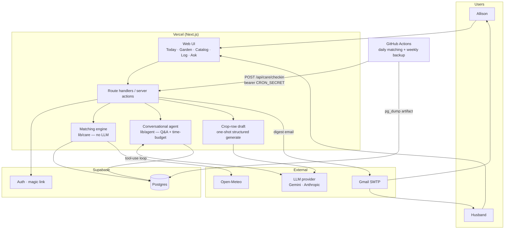

# Architecture

## Overview

GreenThumb is a household garden app for Allison and her husband: one 50′ × 3′ raised bed (seasonal sections) plus eight permanent pots. It remembers what is planted where, computes a daily care list from stored crop needs crossed with weather and the care log, and uses an LLM only when they want to talk — drafting a new crop row, answering questions about this garden, or cutting an already-computed list to the hours they have.

The daily list is matching, not a model. Using an LLM to decide or phrase watering, fertilizing, pruning, frost, harvest, or planting-window tasks is retired. The model earns its keep on conversation and on a one-shot crop-row draft. Design horizon is a one-month capstone demo around **September 3, 2026**, on free or near-free infrastructure, for 2 users and ~14 growing locations.

This document replaces the previous architecture, which treated the LLM as the daily care engine and plant-care knowledge as unverifiable model inference.

## Stack

| Layer | Choice | Why |
| --- | --- | --- |
| Framework | Next.js (App Router) + TypeScript | One repo for UI and server. Already deployed. |
| Hosting | Vercel Hobby | Free, push-to-deploy. Daily matching is a short job; conversation still fits function time limits. |
| Database | Supabase Postgres (free) | Relational fits location / crop / planting / log. 500 MB is far beyond this garden. |
| Auth | Supabase Auth, email magic link | No passwords. Two real accounts so the log can say who did what. |
| ORM / migrations | Drizzle | Typed schema, SQL migrations, light in serverless. |
| UI | Tailwind + shadcn/ui | Mobile-first without a design track. |
| LLM | Gemini Flash (dev default); Anthropic Claude available behind the same seam | Conversation, time-budget, and crop-row draft only. Daily list does not call a model. |
| Weather | Open-Meteo | Free, no API key, forecast + recent history + ET₀. |
| Email | Nodemailer over Gmail SMTP (app password) | Free digest to two addresses. No paid SMS. |
| Scheduler | GitHub Actions cron | Free, timezone-controllable. Fires matching + digest, not an agent loop. |

**The LLM sits behind a provider seam (`lib/llm/`).** Provider is selected by `LLM_PROVIDER` (Gemini locally, Anthropic available for the demo path). That split still matters for Q&A and time-budget iteration, but it no longer pays for a morning care run. Gemini's free-tier prompts may be used for training; that is an accepted trade for one household vegetable garden.

**Open-Meteo requires attribution** (CC BY 4.0). A footer credit satisfies this.

## System diagram



Two structural properties:

1. **Matching is a plain TypeScript module with no model dependency.** It can run from a cron route, from Today on demand, and from tests with fixture weather. The demo line “skipped watering because 0.3″ of rain is coming” is a comparison of stored numbers, not a soliloquy.
2. **The conversational agent is also framework-free**, but it is *not* the care writer. It reads the garden, the crop catalog, and the already-computed list. It does not persist watering tasks.

## Folder structure

```
app/
  (auth)/                 magic-link sign-in
  today/                  matching output — the primary screen
  garden/                 locations dashboard (sections, then pots)
  garden/setup/           profile, sun map, season drawing (not a shell tab)
  garden/[locationId]/    plantings for one location
  catalog/                searchable/editable crop care rows
  log/                    action log entry + history
  ask/                    Q&A + time-budget (streamed)
  api/
    care/checkin/         scheduled matching + digest (secret-gated)
    agent/ask/            streaming conversation
lib/
  care/                   matching engine, templates, care_run persistence
  crops/                  catalog validation, repository, one-shot draft
  agent/                  conversational loop, prompts, tools (read-only)
  llm/                    provider seam (anthropic.ts, gemini.ts)
  weather/                Open-Meteo client + cache + normalization
  notify/                 email composition and send with dedupe
  db/                     Drizzle schema, migrations
  garden/                 sun-exposure derivation, day-boundary helpers
scripts/
  checkin.ts              matching run, invoked by GitHub Actions
  run-agent.ts            conversation / crop-draft against the real garden
  seed.ts                 real garden: bed, sun zones, 8 pots
.github/workflows/
  checkin.yml             daily matching cron
  backup.yml              weekly pg_dump
```

**What exists today vs this layout:** garden profile, weather cache, auth, Today cards, and an agent loop with `propose_recommendation` are in the repo. `lib/agent/care-signals.ts` is a prototype matcher with **hardcoded** watering/fertilizer/pruning rules and no crop table. There is no catalog UI, no action-log UI, no Ask stream, no check-in workflow, and no `care_run` table. `recommendation.agent_run_id` is currently `NOT NULL`, which is the wrong shape for matching-produced rows.

**Garden routes (shell/Garden increment).** Product chrome shows **Jory Journal** (branding, not a column) plus `garden.name` from the singleton row. Same five destinations as today (`/today`, `/garden`, `/catalog`, `/log`, `/ask`) plus sign out — identity is not a sixth tab. `/garden` is a locations list only (current bed sections, then pots; name + planting summary; link to `/garden/[locationId]`). No spatial map and no LLM on Garden. Profile, sun map, and season drawing live at `/garden/setup`, linked from the Garden header. Implement `app/garden/setup/page.tsx` as a **static sibling** of `[locationId]` so the word `setup` is never treated as an id (location ids are UUIDs). Empty Garden means `listCurrentLocations()` is empty (no current sections and no pots) — not “no garden row.” `/garden` **server-redirects** to `/garden/setup` in that case. Setup, location pages, and the other four tabs must not redirect on empty. Matching, Catalog, Log, Ask, and auth stay unchanged; `/garden/setup` is already session-gated because the proxy matcher is `/garden/:path*`.

## Data model

### Position still owns sun exposure

Unchanged from the previous architecture, and already in the schema. The bed never moves; sun varies along its 50 feet; section boundaries are re-cut each season.

**Sun exposure is a property of position along the bed, entered once. Sections are seasonal intervals over that strip; their exposure is derived.**

```
Bed, 0 ft ─────────────────────────────────────────────── 50 ft
sun_zone:  [0–18 full_sun] [18–34 part_sun] [34–50 part_shade]   ← permanent

2026 sections: [Sec 1: 0–10][Sec 2: 10–22][Sec 3: 22–34][Sec 4: 34–50]
                  full_sun    mixed         part_sun       part_shade
```

Derived exposure is cached on the section with an `override` hatch. `dryness_factor` on `location` is where “pots dry faster than the bed” lives as data.

### The new central call: crop row is the care knowledge

Plant-care knowledge is **not** inferred at recommendation time. It is a **per-crop lookup row** the household can search and edit. Tomato and Tomato / Sungold are different rows with their own numbers; two plantings of the same name + variety share one row.

```
crop (one row per crop name + optional variety in this garden)
  └─ planting[]  (this season's instances, each in a location)
        └─ action_log[]
        └─ recommendation[]   ← produced by matching, not by the LLM
```

**When the first planting of a combination is saved:** if no crop row exists, insert a stub (ALL-71 drafts care later). The user can edit immediately. Later plantings of the same combination reuse the row. Matching skips a task type when its catalog field is missing rather than guessing.

**Unique key:** `crop.slug` is unique. `catalogSlug(name, variety)` is `cropSlug(name)` when variety is null, otherwise `cropSlug(name) + "--" + cropSlug(variety)` (e.g. `tomato`, `tomato--sungold`, `cherry-tomato`). Blank variety stores `NULL`, never `''`. Do **not** use a nullable unique `(name_slug, variety)` pair — Postgres treats NULLs as distinct and would allow two unnamed Tomatoes. `cropSlug` collapses punctuation to a single hyphen, so `--` cannot appear inside one field.

**Existing plantings:** keep `planting.variety` as a denormalized copy written from the catalog row at insert. Do not drop the column or make it the identity. The migration that adds `crop.variety` splits mixed-variety plantings that currently share one `crop_id`: group by normalized variety (`cropSlug(variety)` or `"none"`); copy a uniform variety onto the original row; if mixed, keep the original for the unnamed group (or one named group if none are unnamed), insert copies of current care fields for the other varieties, and re-point those plantings.

**Identity edits:** saving name or variety recomputes `slug` with the same helper. A collision fails with a clear message and does not persist. Plantings that point at this row get `crop_name` / `variety` updated so lists and the log do not drift. Mechanical uniqueness only: "Cherry tomato" vs Tomato / Cherry stay two rows.

**Identity:** do not key off free-text `planting.crop_name` alone. The FK is source of truth.

### Entities

**Permanent layer** (unchanged):

- `garden` — singleton. Coordinates, timezone, hardiness zone, optional frost dates.
- `bed` — dimensions, soil type.
- `sun_zone` — `(bed_id, start_ft, end_ft, sun_exposure)`. Durable source of truth for sun.
- `location` — `kind = bed_section | pot`, with derived or override sun, `dryness_factor`, notes.

**Seasonal layer** (unchanged): `season`, bed-section locations tied to a season, pots permanent.

**Catalog layer** (new):

- `crop` — one row per crop name + optional variety in this garden:
  - `name`, nullable `variety`, `slug` (unique, from `catalogSlug`)
  - `watering_interval_days`
  - `fertilizing_interval_days`
  - `pruning` — needed? interval or notes (`none` is valid)
  - `frost_sensitive` (boolean)
  - `sun_preference` (`full_sun` | `part_sun` | `part_shade` | `full_shade`)
  - `plant_window_start` / `plant_window_end` (month-day, garden-local)
  - `days_to_harvest_min` / `days_to_harvest_max` (or a harvest window on the calendar)
  - `time_estimates` — minutes per care action (`watered`, `fertilized`, `pruned`, `harvested`, `planted`, frost cover as `observed`/`treated`)
  - `source` (`generated` | `edited` | `stub`)
  - `generated_by_provider` / `generated_by_model` (nullable)
  - `notes` (household corrections that belong on the crop, not the yard)

Pot vs bed dryness is **not** duplicated here; matching multiplies catalog watering interval by `location.dryness_factor`.

**Activity layer:**

- `planting` — `location_id`, **`crop_id`**, denormalized `variety` copied from the catalog row, method, `planted_on`, `removed_on`, status. Keep `crop_name` only as a denormalized label if reads need it; the FK is source of truth.
- Drop LLM harvest columns on planting (`harvest_window_*`, `harvest_confidence`, `harvest_rationale`, `harvest_estimating_model`) as the source of truth. Harvest window = `planted_on` + crop days-to-harvest, refined by logged `harvested` actions.
- `action_log` — append-only ground truth. Users own it. Matching and conversation both read it.
- `garden_note` — yard-specific corrections (“the far end floods”). Injected into **conversation** context. Matching does not parse notes; if a note should change watering, the fix is the crop row or a location note/`dryness_factor`.

**Weather layer** (unchanged): `weather_day`, `weather_fetch`. Cache is what makes “skipped because rain is coming” inspectable after the fact.

**Care-run layer** (replaces agent-as-writer):

- `care_run` — trigger (`scheduled` | `manual` | `after_write` | `simulated`), status, timings, `weather_fetch_id`, optional `simulated_weather`, counts of tasks written. No provider, no tokens.
- `recommendation` — persisted daily list item: `care_run_id` (not `agent_run_id`), `location_id`, `planting_id`, `crop_id`, `action_type`, `urgency`, templated `headline` / `rationale`, `evidence` (checkable inputs only), `estimated_minutes` copied from the crop row at compute time, `status` (open / done / dismissed / superseded / expired).
- `agent_run` — **conversation and crop-draft only.** Kinds: `ask`, `time_budget`, `crop_draft`, `script`, `test`. Remove `scheduled_checkin` as an LLM kind.
- `conversation` / `message` — Ask and time-budget history; assistant messages link to `agent_run`.
- `notification` — digest send record + `dedupe_key`.

Recommendations stay stored so they are alertable, dismissible, and demoable. They are no longer born from a tool call.

### Matching rules (deterministic)

Pure function: `evaluateCareList(crop × location × planting × weather × log × today) → tasks`.

| Task | When it appears | Rain / weather |
| --- | --- | --- |
| Water | Days since last `watered` (or planted) ≥ crop interval, scaled by `dryness_factor` and recent ET₀ / precip credit | Meaningful upcoming rain **skips or downgrades** and the template says so |
| Fertilize | Days since last `fertilized` ≥ crop interval; skip if crop says none | — |
| Prune | Crop says pruning is needed and interval elapsed | — |
| Frost | Crop `frost_sensitive` and forecast min ≤ threshold | Urgency now if tonight |
| Harvest | Today inside `planted_on` + crop harvest window; not yet logged harvested | — |
| Planting window | Empty location (or planned planting) and today inside crop window | — |
| Sun mismatch | Crop `sun_preference` vs location exposure (including mixed sections) | Warning, not a watering task |

**Missing catalog fields:** matching **skips a task type when its catalog field is missing** rather than guessing a cadence. A stub tomato with no `watering_interval_days` does not get a watering task until someone edits the row. Pruning `none` is an explicit “do not prune,” which is different from pruning left unset. This catalog story only supplies the data; it does not implement `lib/care`.

Growth stage may **thinly** scale an interval (seedling vs fruiting) from `planted_on` + method. It is not a reason to regenerate the crop row.

**Copy is templated** from the same inputs, e.g. `Section 3 — water today: last watered 4 days ago, 0.1″ rain this week, tomatoes want water every 3 days`. No model pass to phrase it.

**Honesty:** the old facts-vs-inferences split existed because care knowledge was an LLM guess. That is obsolete for Today. Cards cite catalog fields, weather rows, and log dates — all editable or cached. Confidence as a 0–1 model score is not required on matching rows. Conversation can still be wrong; the correction path for care knowledge is **edit the crop row**, not a better prompt tomorrow.

**Known v1 limit:** no sensors, so matching cannot see this yard’s microclimate. Say so once in the UI. Partial correction: crop row, location notes, `dryness_factor`, `garden_note` for chat.

## External services

| Service | Purpose | Auth | Failure mode |
| --- | --- | --- | --- |
| Anthropic Claude | Q&A, time-budget, optional crop draft on the demo path | `ANTHROPIC_API_KEY` | Fail over to Gemini; if both fail, conversation errors and Today still works |
| Google Gemini | Same workloads in development | `GEMINI_API_KEY` | Quota → backoff; Today still works |
| Open-Meteo | Forecast + history + ET₀ | None | Serve cache; matching notes staleness |
| Supabase | Postgres + Auth | Service role unused for queries; `DATABASE_URL` server-side | Hard dependency. Daily cron prevents idle pause |
| Gmail SMTP | Digest email | App password | Log failure; Today remains source of truth |
| GitHub Actions | Matching schedule + backups | Repo secrets | Missed run visible in Actions |

Daily matching does not call a model, so a provider outage cannot blank the morning list if weather cache and catalog exist.

## Auth & authz

Unchanged and still the right call:

- Magic link, two allowlisted addresses (`ALLOWED_EMAILS`), server-side admission on callback.
- Any authenticated user is a full member of the one garden. No roles.
- Browser never talks to Postgres. Server actions and route handlers check the session. RLS deny-by-default remains the backstop (ALL-16).
- Scheduled matching is **not** a user session: `POST /api/care/checkin` with bearer `CRON_SECRET` (ALL-14 still applies — the route must not be a public “spend money / send mail” button, even though it no longer spends LLM credits).
- **Do not change the auth proxy for this increment.** `/garden/setup` and `/garden/[id]` inherit protection from `/garden`. Empty-garden send-to-setup is a server `redirect` on the dashboard page only — not middleware that would loop with setup or run a locations query on every Garden request.

## Key data flows

These are the in-scope journeys. Everything else is a prompt or a screen on top of them.

### 1. Crop catalog (ALL-43)

```
User records a planting (crop name + variety + location + planted_on)
  └─ resolve crop by catalogSlug(name, variety)
      ├─ exists → attach planting.crop_id, copy catalog name/variety onto planting
      └─ missing → insert stub crop (ALL-71 drafts care later)
  └─ catalog add of a duplicate combination is an error that points at the existing row
  └─ user can search / open / edit the row at any time (slug recomputed on identity save)
  └─ next matching run reads the edited fields
```

Draft is a single structured model call with a hard token/time bound — not `runAgent`. Invalid JSON or out-of-range cadences are rejected; never write raw model text into matching inputs.

### 2. Deterministic Today list (ALL-44)

```
Trigger: GitHub Actions 06:00 garden-local
      or Today refresh / after log or catalog write
  └─ POST /api/care/checkin  (cron)  or server-side runCareCheckin()
      └─ refresh weather cache (or use simulated_weather)
      └─ load current locations, plantings + crops, care log
      └─ evaluateCareList(...)          ← no LLM
      └─ persist recommendations on a care_run
           (supersede still-open same location+action)
      └─ if any urgency ∈ {now, today}: one digest email, deduped
  └─ Today page lists open rows, grouped by urgency
      └─ Done → action_log + close recommendation
      └─ Dismiss → close without a log row
```

The user does not have to ask. Opening Today is enough. `lib/agent/care-signals.ts` is a sketch of this function; it must move to `lib/care` and **read the catalog** instead of a 3-day constant and a tomato/pepper regex.

### 3. Time-budget conversation (ALL-42)

```
User: "I have two hours Saturday and two hours Sunday"
  └─ /api/agent/ask  kind=time_budget
      └─ agent loop, read-only tools:
           get_open_recommendations()   ← already-computed list
           get_crop_catalog()           ← minutes per task
           get_current_locations() / get_plantings() as needed
      └─ reply: definitely do X, Y, Z; try A, B if you have time
      └─ does not call any write tool; does not invent tasks
```

Hours are the constraint. Time estimates on the crop row are what make the cut honest. If a task has no estimate, say so and keep it out of the timed pack, or use a visible default the user can edit on the crop.

### 4. General garden Q&A (ALL-10)

```
User: "Do peppers want full sun?" / "Should I water the peppers today?"
  └─ same engine, kind=ask, different system prompt
      └─ tools: crop rows + this garden (locations, plantings, weather,
         care log, open tasks, garden notes)
      └─ answers from stored rows and matching output, not a generic chatbot
      └─ still no garden-state writes
```

This is the capstone’s agentic demonstration: tool use over garden context, not the morning list.

### 5. Logging an action (ALL-7)

Unmediated by the agent. Immediate write. Next matching run (or an `after_write` recompute) stops asking for that water.

### 6. Re-cutting the bed (ALL-5)

Unchanged data: new `season`, new section intervals, sun re-derived from untouched `sun_zone` rows. **UI move only:** that work happens on `/garden/setup`, not on the locations dashboard.

### 7. Garden dashboard vs setup (ALL-90–ALL-93)

```
Authenticated chrome
  └─ product label “Jory Journal” (constant)
  └─ garden.name from the singleton (existing column; no new table)
  └─ five tabs unchanged; Today remains home

GET /garden
  └─ listCurrentLocations()
      ├─ empty → 307/redirect /garden/setup
      └─ else → sections list, then pots; each row → /garden/[locationId]
           header link → /garden/setup
           no profile form, no sun map, no season drawing, no LLM

GET /garden/setup
  └─ existing profile / sun / season forms (moved, not rewritten)
  └─ never redirect “because empty” (that is how you unstick first-run)

GET /garden/[locationId]
  └─ existing plantings page; UUID only
```

No schema change. `garden.name` is already defaulted (`Jory Journal Garden`). Chrome loads it on the server (layout or a small server shell), not a client fetch to Postgres.

## Conversational agent

**One engine, two prompts, a read-only tool layer.** Shared tools:

- `get_garden_profile`
- `get_current_locations`
- `get_plantings`
- `get_crop_catalog` *(new)* — must return `variety` and search name, variety, and slug so Ask/time-budget can tell Tomato from Tomato / Sungold. Matching template copy names the variety when present.
- `get_care_history`
- `get_weather`
- `get_garden_notes`
- `get_open_recommendations`

**Removed from the conversational path:** `propose_recommendation`. The matching engine persists the list. ALL-27’s old allowance (“the agent may write `propose_recommendation` and `save_harvest_estimate`”) is withdrawn. Harvest is computed from the crop row. The agent may not insert plantings, log rows, crop edits, or recommendations.

Crop-row generation is a **separate one-shot module** (`lib/crops/draft.ts`), not a tool the chat loop can fire unbounded.

Bounds (iterations, tokens, wall-clock) stay on the loop. Spend caps and Q&A rate limits (ALL-15) apply to conversation and drafts only — not to the daily list.

Prompt construction: user-entered crop names, notes, and catalog text go in delimited data sections, never concatenated into instructions.

## Infrastructure & deployment

- **Deploy**: push to `main` → Vercel. Preview deploys per branch.
- **Migrations**: Drizzle SQL, applied deliberately, checked in.
- **Seed**: real bed, sun zones, pots; catalog rows come from plantings + draft/edit.
- **Schedule**: `.github/workflows/checkin.yml` at 06:00 garden-local → `POST /api/care/checkin`. Not Vercel Hobby cron (UTC-only, ±59 minutes).
- **Backups**: weekly `pg_dump` artifact (ALL-28). Garden profile and the action log are slow or impossible to recreate from memory.
- **Observability**: `care_run` for the list (inputs, weather fetch, task counts). `agent_run` for chat/draft (provider, tokens, tool trace, cost). Internal `/runs` can show both.
- **Secrets**: Vercel + Actions. `LLM_PROVIDER`, `ANTHROPIC_API_KEY`, `GEMINI_API_KEY`, `DATABASE_URL`, `SUPABASE_URL`, `SUPABASE_ANON_KEY`, `GMAIL_APP_PASSWORD`, `CRON_SECRET`, `ALLOWED_EMAILS`, `SITE_URL`. Never `NEXT_PUBLIC_` on secrets.

### Suggested build sequence

Ordered so the graded demo (weather-adjusted list) is matching, and agentic behavior still ships on conversation — without spending the last week rewriting the care path.

| Phase | Work | Rationale |
| --- | --- | --- |
| 1 | Crop table + `planting.crop_id`, catalog search/edit UI, stub rows | Matching has nothing to read until this exists |
| 2 | One-shot crop draft + validation | First planting should not be a blank form if the model is up |
| 3 | Matching engine reads catalog × weather × log; persist on `care_run`; Today shows those rows | Demo spine. Retire `propose_recommendation` as the list writer |
| 4 | Action log UI; recompute after write | Ground truth the matcher needs |
| 5 | Scheduled matching check-in + digest | Proactive without an LLM loop |
| 6 | Ask (read-only tools including catalog + open list) | Agentic demo |
| 7 | Time-budget prompt on the same engine | Overlay; needs minutes on the crop row |
| Buffer | Simulated weather **into matching**, real-data rehearsal | September may be dry |

Planting-window suggestions remain the weakest September demo; they are cheap once the catalog exists and can slip if the buffer is gone. Harvest windows demo well against what is in the ground.

### Estimated running cost

**Steady state:** Vercel, Supabase, Open-Meteo, Gmail, Actions ≈ $0. Daily matching ≈ $0 LLM. Conversation + occasional crop drafts on Gemini free tier ≈ $0 in development. A paid Anthropic demo path for Ask / time-budget is a few dollars, not a daily Sonnet loop.

**What changed:** the previous estimate (~$0.14 per check-in × 100 tuning runs/day) no longer applies to care. The $100 Anthropic balance is for conversation rehearsal and the graded tool-use demo, not for regenerating Today.

**Still required:** loop bounds and a monthly conversation spend alert (ALL-15), retargeted off the old “daily agent check-in” burn model. An unbounded **chat** loop can still waste credits; an unbounded **matching** run cannot.

Sonnet’s introductory rate ends **August 31, 2026**. If the demo path uses Anthropic that week, expect higher per-token cost. Matching is unaffected.

## Open decisions

Product and ops questions, not blockers for this shape:

- **Current season contents** — what is in the ground now, for seed data and a live demo.
- **Whether planting-window tasks make the September demo** — architecture keeps them as matching output; the PO ranks them.
- **Web push** — deferred. Email digest + Today. Revisit only if email is insufficient; iOS push needs home-screen install.
- **Final conversation provider** — Gemini vs Anthropic for Ask / time-budget, decided from `agent_run` traces, not from care quality (care is not a model).
- **Monthly conversation spend alert thresholds** — size against chat/draft burn, not the retired daily-loop table. ALL-15 must be rewritten to match.
- **Post-capstone** — idle Supabase pause; decide before next season.
- **Truncated success metric** in `greenthumb-spec.md` (“without asce”) — product, not architecture. This brief supersedes that spec.

Resolved here, previously listed as architect questions:

- Crop vs planting: FK `planting.crop_id` → one catalog row per name + optional variety; `planting.variety` is a denormalized copy; generate on first sight of a combination (ALL-71).
- Daily check-in: matching + `care_run`, not `runAgent`.
- Time estimates: on the crop row, copied onto each recommendation at compute time.
- Sun vs sections: position-based sun, already in the schema.
- Microclimate: stated limitation; edit crop/location, don’t prompt harder.

## Known constraints & tradeoffs

**Deliberately left simple:**

- **No multi-tenancy.** One garden. No `garden_id` scoping discipline beyond the singleton.
- **No roles.** Both users are equal.
- **No queue, no extra cache layer, no worker pool.** Matching over 14 locations is a function call. A queue would be theater.
- **No trained ML model** for care. Catalog + matching, not a fitted predictor.
- **No plant encyclopedia.** Catalog only holds crops in (or being added to) this garden.
- **No SMS.** Push-or-email; email first.

**Accepted limitations:**

- **Crop drafts can be wrong.** Correction is editing the row. Matching will faithfully use a bad interval until someone edits it — that is the point of a visible catalog.
- **No microclimate sensors.** Regional forecast + manual facts.
- **Email deliverability is not guaranteed.** Today is the durable list.
- **September weather may be dull.** Simulated weather feeds **matching**, labeled in the UI (ALL-22 must be retargeted).
- **Free-tier edges:** Supabase idle pause (cron prevents it); no automated backups (`pg_dump`); 1-day platform logs (`care_run` / `agent_run` cover it); Gemini RPM limits affect chat iteration only.

**Retired (do not build):**

- LLM as daily care engine, including using a model to *phrase* Today.
- `propose_recommendation` as the list writer.
- Facts-vs-inferences as the primary honesty device for watering advice.
- One agent engine that both computes care and answers questions.
- Harvest windows as LLM-estimated columns on `planting`.
- SMS / Twilio.
- Yield / volume planning.
